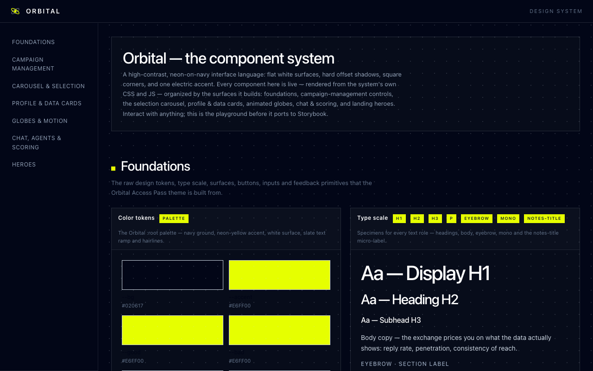

# Orbital

**A high-contrast, neon-on-navy interface system — every component live, in one playground.**

[**▶ Live demo**](https://orbital-eta-six.vercel.app) · flat white surfaces · hard offset shadows · square corners · one electric accent



---

## What this is

Orbital is a small, opinionated design system with a single self-contained gallery that shows **every component running** — not static swatches, but the real, interactive thing: animated globes, a swipe-to-select carousel, retro campaign-control panels with live sliders, a chat thread that types, a score ring that draws itself.

It was extracted from a working product prototype, so the gallery reuses the **exact same CSS and JavaScript that ship in the product** — no re-implementation, no drift. What you see in the gallery is what runs in production.

## The language

| | |
|---|---|
| **Ground** | deep navy `#020617` |
| **Surface** | flat white, no blur |
| **Accent** | one electric yellow `#E6FF00` |
| **Depth** | hard `4px` offset shadows, never soft glows |
| **Corners** | square (`2px` max) |
| **Type** | system sans, tight tracking on display, wide tracking on labels |

Status is never communicated by color alone — every signal carries a shape, icon, or label too.

## What's inside

- **Foundations** — color tokens, type scale, radii & shadow, the full button + chip set, inputs, surfaces, toast
- **Campaign Management** — dot-matrix mission control with live macro sliders, a retro creator console (dial, LCD, toggle), stage tabs, telemetry meters
- **Carousel & Selection** — a 3D swipe-to-approve deck
- **Profile & Data Cards** — roster cards, live comment cards, investor cards, a hanging price tag, stat cards
- **Globes & Motion** — a rotating wireframe match globe, a resonance particle emitter, a perspective lattice, a ticker
- **Chat, Agents & Scoring** — a live chat thread, message bubbles, an animated XRS score ring
- **Heroes** — a split-panel video hero and an editorial agency-grid wall

## How it's built

The gallery is a single static `index.html` — no framework, no build step to view it. It's assembled by a small, deterministic pipeline:

1. **Component specs** live as JSON in [`design-system/specs/`](design-system/specs) — one file per category, each describing a component's demo markup, the element IDs its JavaScript needs, and the init calls that bring it to life.
2. **The builder** ([`design-system/build_gallery.py`](design-system/build_gallery.py)) pulls the system's CSS and driver JS verbatim, composes the component frames from the specs, and emits `index.html`.

Because the styles and scripts are reused as-is, every component renders with zero fidelity loss.

## Run it locally

```bash
# any static server works — no dependencies
python3 -m http.server 8000
# then open http://localhost:8000
```

To rebuild after editing a spec:

```bash
python3 design-system/build_gallery.py
```

## Roadmap

- [ ] Port the per-category specs to **Storybook** (the spec files are already a clean manifest)
- [ ] Extract tokens to a shared `tokens.css` / JSON
- [ ] Swap placeholder media for openly-licensed assets (see Credits)

## Credits & media

The interface design, CSS, and JavaScript are original work. Two pieces of media are **placeholders** — replace them before reusing commercially:

- **Avatar photos** in `faces/` are placeholder portraits from [pravatar.cc](https://pravatar.cc).
- **Hero clips** (`hero-*.mp4`) are the author's own footage, included for demo only.

## License

[MIT](LICENSE) © Rob Simon
